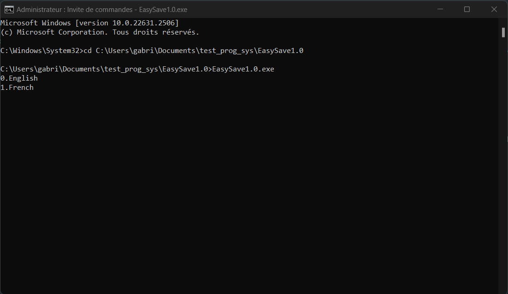
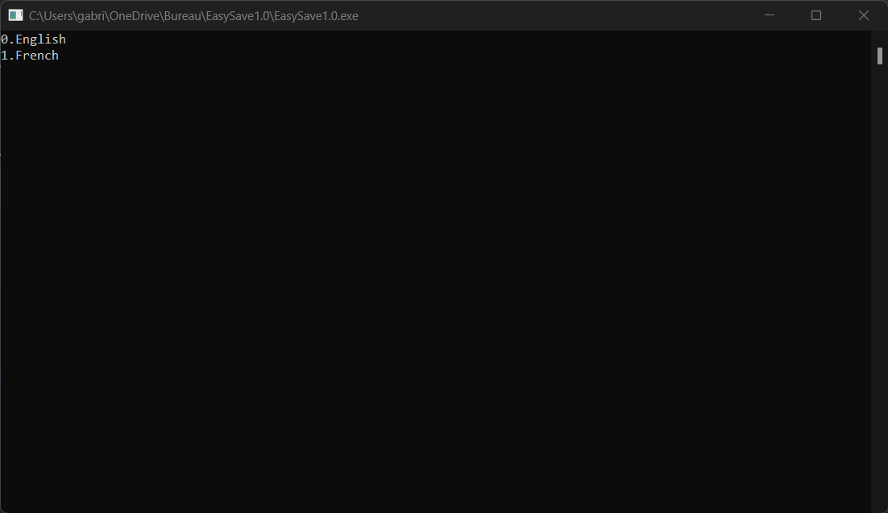
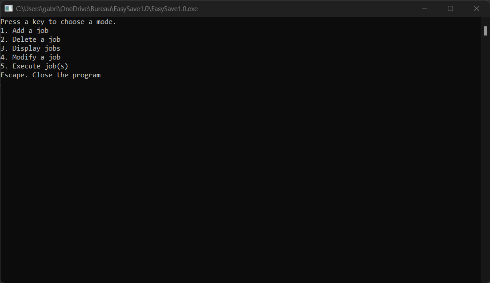
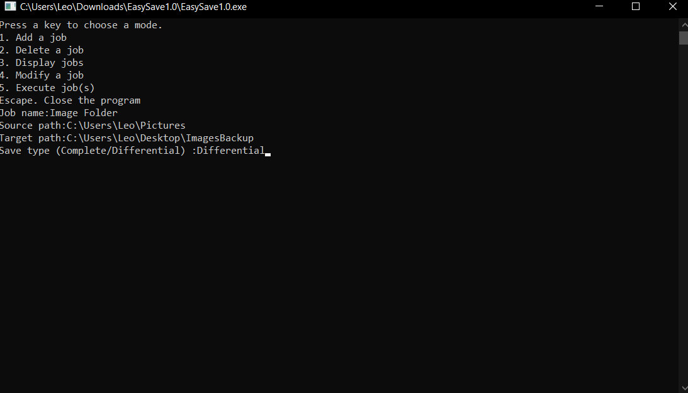
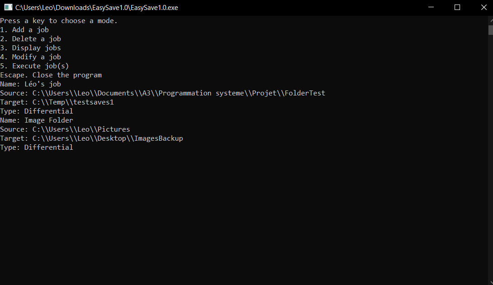

# Prog_sys : EasySave 

# User manual

---

## Table of contents
1. [Description](#description)
2. [Installation](#installation)
3. [Mode](#mode)

## Description
EasySave is a backup software that allows you to save your files in a secure way. You can choose the files you want to save, the destination folder and the type of compression you want to use. You can also choose to encrypt your files with a password. This software is a command line software that can be used in two modes : Backup and Restore. It is developed in C# and is compatible with Windows 10.

## Installation
To install EasySave, you just have to download the .zip file and extract it. Then, you can launch the .exe file.

## Starting
To start EasySave, you just have to launch the .exe file. You can also launch it with the command line. To do this, you have to open the command line and enter the path of the .exe file. For example : `C:\Users\user\Downloads\EasySave1.0.exe`

## Langage choice
When you installed and launch EasySave software, a black screen "Command prompt" appears. It asks you to choose a langage.

## Mode
When you installed and launch EasySave software, a black screen "Command prompt" appears. It asks you to choose a mode. 
There is five available modes : "Add a job", "Delete a job", "Display a job", "Modify a job", "Execute job(s)".
You just have to type the name of the mode you want to use.

### Add a job

### Display a job

### Execute a job
To execute a job, you have to type five, then the software asks the range of jobs to execute.
You can launch one or several backups with the following commands:

    5 : Launch the backup 5
    1;2;3 : Launch the backups 1, 2 and 3
    1-4 : Launch the backups from 1 to 4
    1-4;6;8-10 : Launch the backups from 1 to 4, 6 and from 8 to 10

You can also call the program in the command prompt with the following command: 
        
`EasySave1.0.exe -e 1;3-5`

